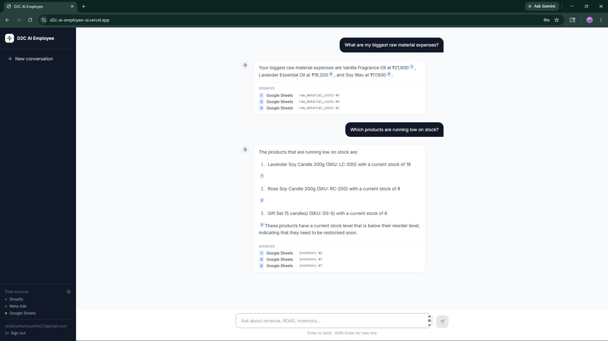

# D2C AI Employee

An AI employee for D2C brands — connects your Shopify store, Meta Ads account, and Google Sheets, normalises everything into a shared data model, and answers questions in natural language with every number cited back to the source row.

---

## 1. What I Built

**Backend:** FastAPI + Groq `llama-3.3-70b-versatile` (OpenAI-compatible API, free tier). Connectors pull data into Supabase via a normalised, source-agnostic schema. The agent runs a tool-calling loop over that data and enforces citations on every number before the answer reaches the user.

**Frontend:** Next.js 14 App Router chat UI + a settings page where non-technical founders paste their API keys and sheet URLs. No `.env` editing, no backend restarts — credentials are stored per-merchant in Supabase and read fresh on every sync.

**Data flow:** `fetch_*()` → `normalize_*()` → `upsert_all()` → Supabase → agent tools → cited answer.

**Scheduling:** APScheduler runs a full sync every 6 hours and autonomous agent checks at a configurable interval (default 24 h, set via `AGENT_CHECK_INTERVAL_MINUTES` env var). Both can be triggered manually — sync via the Settings UI, agent checks via `python -m src.agent.runner`.

---

## 2. Connectors

Three connectors, each behind the same contract: `sync(merchant_id) -> list[NormalizedRecord]`.

| Connector | Tables populated | Why first |
|-----------|-----------------|-----------|
| **Shopify** | `orders`, `order_items`, `customers`, `products` | Single source of truth for D2C revenue and fulfilment. The KPIs most founders care about live here. |
| **Meta Ads** | `ad_spend` | The dominant paid acquisition channel for D2C brands in India and globally. ROAS is the most-asked question in any D2C ops review. |
| **Google Sheets** | `inventory`, `raw_material_costs`, `vendors`, `monthly_budget` | Every D2C founder already has spreadsheets for things that don't have a dedicated SaaS. Supporting Sheets means instant compatibility with real-world ops without custom integrations. |

**What I didn't build:** WooCommerce (smaller target market than Shopify), Google Ads (Meta-first D2C brands are the majority in our target). Adding any of these is one file + one line in `src/connectors/registry.py`.

**Connector contract** (`src/connectors/base.py`):
```python
NormalizedRecord(table, data, source, source_id)
```
Every record that lands in Supabase carries `source` and `source_id` for full provenance. The registry (`src/connectors/registry.py`) is a list of `(name, sync_fn)` tuples — enable or disable a connector by commenting it in/out.

---

## 3. Schema

**Shape:** Source-agnostic tables. One `orders` table, not `shopify_orders`. One `ad_spend` table, not `meta_campaigns`. This means a query tool doesn't need to know which connector the data came from — it queries one table and the provenance columns tell the agent where each row originated.

**Provenance on every row:** `source` (connector name), `source_id` (source-system identifier), `synced_at`. Any number the agent cites can be traced back to the row that produced it.

**Why `customer_id` in `orders` is TEXT, not a FK:** Shopify customer IDs are string GIDs (e.g. `"gid://shopify/Customer/12345"`). Orders and customers sync in separate passes and order is not guaranteed. A FK constraint would break the sync on any ordering quirk. External IDs stay as TEXT throughout; Supabase internal bigserial PKs are only for internal joins.

**Upsert idempotency:** `UPSERT_KEYS` in `src/ingestion/upsert.py` maps every table to its conflict columns. Re-running sync never duplicates rows. Full list:

```
customers:          (source, external_id)
products:           (source, external_id)
orders:             (source, external_id)
order_items:        (source_id)
ad_spend:           (source, date, platform, campaign_name)
inventory:          (source, sku)
raw_material_costs: (material, vendor_name)
vendors:            (source, vendor_name)
monthly_budget:     (month, category)
```

Full DDL is in `docs/schema.sql`. Run it against a fresh Supabase project to build the entire database.

---

## 4. Chat — Tools and Citations

The agent has 12 tools across two categories.

**Read tools (10):**
```python
query_sales(from_date, to_date)
  → {total_revenue, order_count, aov, citations}

query_ad_spend(platform?, from_date?)
  → {total_spend, roas, by_campaign, citations}

query_products(limit?)
  → {top_products, citations}

query_customers()
  → {customer_count, repeat_rate_pct, citations}

query_inventory()
  → {inventory, low_stock_items, citations}

query_raw_materials()
  → {materials (sorted by monthly_cost desc), citations}

query_vendors()
  → {vendors (sorted by rating desc), citations}

query_budget(month?)
  → {budget_rows, over_budget_categories, variance, citations}

query_roas_trend()
  → {weeks, roas_values, citations}

query_sales_trend()
  → {weeks, revenue_values, citations}
```

**Utility tools (2):**
```python
get_merchant_config(key)
  → per-merchant setting (e.g. "currency_symbol" → "₹")

log_agent_run(check_name, status, reasoning, proposed_action?)
  → persists autonomous agent findings to agent_runs table
```

**How citations work:**

The agent system prompt mandates the format `[source:table#id]` on every number — e.g. `Revenue was ₹1,24,500 [shopify:orders#42]`. The instruction states explicitly: *"Uncited claims must not reach the user."*

Every tool returns a `citations` array alongside data. The agent must reference an ID from that array. Fabricating an ID that wasn't returned by the tool is detectable — the UI renders citations as numbered superscript badges that link back to the source.

---

## 5. Agent

**What it does:** The autonomous agent (`src/agent/runner.py`) runs four checks on the live data and writes its reasoning and proposed action to `agent_runs`.

Current checks (run on a configurable schedule, default 24 h):
1. **ROAS erosion:** ROAS dropped more than 20% week-over-week on any platform — flags specific campaigns and proposes bid adjustment.
2. **Low inventory:** Any SKU with fewer than 10 units — proposes a reorder action with quantity.
3. **Repeat customer rate:** If the 30-day repeat rate falls below 20% — proposes a retention action (discount, winback campaign).
4. **Budget overrun:** Any category more than 10% over budget for the most recent month — flags category with variance and proposes corrective action.

**Why this agent:** These are the three "wake me up at 3am" categories for a D2C ops team. They're not dashboard widgets — they're the things a human ops manager would flag in a review. Automating the detection and writing the reasoning in plain language is the minimum useful version of an AI employee.

Every run in `agent_runs` has: `check_name`, `status` (`ok` / `warning` / `action_needed`), `reasoning` (plain English with cited numbers), and `proposed_action`.

---

## 6. Sample Conversations

These are based on the sample Google Sheets data (`data/create_sample_sheets.py` — a candle D2C brand). Connect your own sheet and the same questions will work against your live data.

- **"What are my biggest raw material expenses?"**
- **"Which products are running low on stock?"**

### Example Output



---

## 7. Scale — 1 Merchant to 10,000

**What's already multi-tenant:**
- `merchant_credentials` table: per-merchant connector credentials, scoped by `merchant_id` UUID (Supabase auth UID)
- `merchant_config` table: per-merchant config (currency, thresholds), composite PK `(merchant_id, key)`
- Every API request carries the authenticated `user_id` via Supabase JWT — no `merchant_id` in the request body
- Every `sync(merchant_id)` call reads credentials fresh from the DB — no shared state

**What breaks first (honest):**

1. **Data tables have no `merchant_id` column.** Orders, products, etc. are currently shared across all merchants. At merchant #2 this becomes a problem. Fix: add `merchant_id TEXT NOT NULL DEFAULT 'default'` to each data table and add it to every `UPSERT_KEY`. One migration, ~1 day of work.

2. **Sync is synchronous and sequential.** The current sync job iterates connectors one at a time. At 100 merchants this takes minutes. Fix: push sync jobs to a task queue (Celery + Redis, or Supabase Edge Functions). Each merchant gets its own job. The connector contract (`sync(merchant_id)`) is already queue-friendly — the orchestrator changes, the connectors don't.

3. **Supabase connection pool exhaustion.** The default pool is 15 connections. At ~50 concurrent syncs this saturates. Fix: use Supabase's built-in pgBouncer in transaction pooling mode — already available on the Pro plan, just change the connection string.

4. **Groq free-tier rate limits.** `llama-3.3-70b-versatile` allows 30 requests/min on the free tier. At 100 concurrent users this saturates in seconds. Fix: upgrade to Groq paid tier or add a secondary LLM (Together AI, OpenRouter) as overflow.

5. **At 10,000 merchants with 6-hour sync:** ~28 syncs/minute sustained. Needs horizontally scaled workers (K8s job pods or AWS Lambda), a message broker (SQS/Redis Streams), and per-merchant rate-limit tracking to avoid hitting Shopify/Meta API rate limits. The Shopify connector already supports `updated_since` for incremental sync to keep payload sizes manageable.

**What's already designed for scale:**
- Idempotent upserts — workers can retry without duplicating data
- Connector registry — adding or removing a connector doesn't touch the orchestration layer
- Per-merchant credential isolation — no shared secrets, no cross-tenant credential leakage
- `AGENT_CHECK_INTERVAL_MINUTES` env var — tune check frequency without code changes

---

## 8. Eval — Where It Breaks

**No live API tests.** Shopify and Meta connector tests mock the HTTP responses. If Shopify changes a field name or paginates differently, the connector silently drops data. Integration tests against a Shopify dev store would catch this.

**Full re-fetch on every sync.** No cursor/incremental sync for Shopify orders or Meta ad spend. A store with 100k orders re-fetches all of them. This will hit Shopify's API rate limits quickly. Fix: implement `updated_since` on Shopify (stubbed in `fetch_shopify()`).

**Citation enforcement is instruction-based, not programmatic.** The Groq agent is instructed to cite every number, but there's no post-response checker that rejects uncited values. A model that hallucinates a row ID that happens to be a valid Supabase ID would pass undetected. A real citation verifier would extract cited IDs and re-query the DB to confirm they exist and match the stated value.

**Tool call latency stacks.** Each tool call round-trip adds ~400–700ms. Complex queries that need 3–4 tool calls (currency config → data → trend) take 3–5s. Streaming the response would improve perceived latency.

**No retry or transaction semantics.** If a connector call fails mid-sync, partial data lands with no rollback. Fix: track sync state per-connector and retry failed connectors independently.

**No real OAuth for Google Sheets.** Users must manually share their sheet with the service account email. This is confusing for non-technical founders. A proper Google OAuth flow would remove this friction.

---

## 9. Hours Spent

~24 hours across 4 days:
- Day 1 (~6h): Connector skeleton, normalisation, Supabase upsert, basic FastAPI endpoints
- Day 2 (~8h): Agent tools, citation system, autonomous runner, settings UI, multi-tenant credentials, Supabase auth
- Day 3 (~6h): Groq integration, sheet query tools, frontend citation rendering, test suite, deploy to Railway + Vercel
- Day 4 (~4h): Autonomous check scheduling, manual sync button, env var config, README

**AI tools used:** Claude Code for code generation and iteration — connector normalisation boilerplate, settings UI components, test mocks, tool dispatch logic. Architecture decisions, schema choices, connector selection, and agent design were mine. I'd estimate ~45% of lines were AI-generated first draft, ~55% written or substantially edited by hand.

---

## 10. What I'd Do with Another Week

1. **Add `merchant_id` to all data tables** — complete multi-tenant isolation and make it safe to run multiple merchants against the same DB instance.
2. **Incremental sync with cursors** — `updated_since` on Shopify, date-range delta on Meta. Cuts sync time from O(total records) to O(new records).
3. **Google OAuth connector** — replace the service account flow with a one-click "Connect Google" button. Biggest non-technical user friction point.
4. **Citation verifier** — post-response check that re-queries Supabase for each cited `(table, id)` and confirms the value matches. Makes citation fraud structurally hard, not just instructed-away.

---

## Running Locally

```bash
# Python backend
pip install -r requirements.txt
cp .env.example .env  # fill in SUPABASE_URL, SUPABASE_KEY, GROQ_API_KEY
uvicorn src.api:app --reload --port 8000

# Next.js frontend (separate terminal)
cd frontend
npm install
npm run dev  # http://localhost:3000
```

**Required env vars:**
```
SUPABASE_URL=
SUPABASE_KEY=
GROQ_API_KEY=
```

**Optional:**
```
GOOGLE_SERVICE_ACCOUNT_JSON=   # for Google Sheets connector
GOOGLE_GENAI_API_KEY=          # unused — kept for config compatibility
AGENT_CHECK_INTERVAL_MINUTES=  # default 1440 (24h)
```

All connector credentials (Shopify, Meta, Google Sheets) are configured at runtime through the Settings UI at `/settings`. No `.env` changes needed after initial setup.

```bash
# Run tests
pytest tests/
cd frontend && npm test

# Trigger a manual sync for a specific merchant
python -m scripts.run_sync --merchant-id <uuid>

# Run autonomous agent checks immediately
python -m src.agent.runner
```
